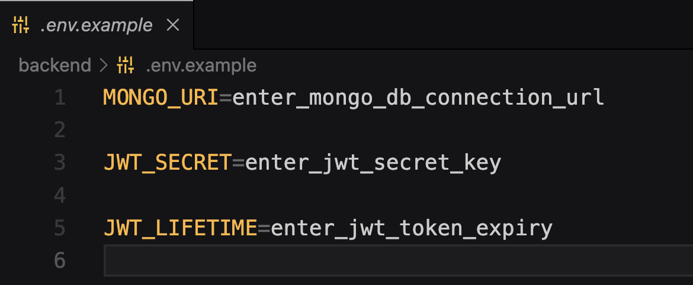

## RESOURCE BOOKING SYSTEM

As there are multiple resources working on multiple projects it becomes difficult to manage the workload and get a proper idea which resources are under or over-utilized. Hence build a web application portal to do the projection for members with respect to projects on a weekly basis. Also if the resources are on leave or there is a holiday the capacity of the members will have to be reduced accordingly.

### 🔗 Content

- [Overview](#resource-booking-system)
- [Content](#-content)
- [Team](#-team)
- [Problem Statement](#-problem-statement)
- [Features](#-features)
- [Vision](#-vision)
- [Tech Stack](#-tech-stack)
- [API Reference](#-api-reference)
- [Environment Variables](#-environment-variables)
- [Run Locally](#-run-locally)
- [Documentation](#-documentation)
- [Screen-Shots](#-screen-shots)

### 👨‍👦‍👦 Team

- `Atharva Parkhe` -  *Python* -   [LinkedIn](https://www.linkedin.com/in/atharva-parkhe-3283b2202/), [GitHub](https://github.com/atharvparkhe) - Backend Developer

- `Sachin Padwalkar` -  *JavaScript* - [LinkedIn](https://www.linkedin.com/in/sachin-padwalkar-a265291ba/), [GitHub](https://github.com/Sachin9822)  -  Frontend Developer

- `Edgar Camelo` -  *JavaScript* - [Instagram](https://www.instagram.com/edgarandrewcamelo/), [GitHub](https://github.com/edgarAndrew)  -  Full Stack Developer

- `Pratham Shankhwalker` -  *Python* - [LinkedIn](https://www.linkedin.com/in/pratham-shankwalker-ab2899205/), [GitHub](https://github.com/prathamshankwalker)  -  Machine Learning (ML) Developer


### 📃 Problem Statement

As there are multiple resources working on multiple projects it becomes difficult to manage the workload and get a proper idea which resources are under or over-utilized. Hence build a web application portal to do the projection for members with respect to projects on a weekly basis. Also if the resources are on leave or there is a holiday the capacity of the members will have to be reduced accordingly.

- **Admin Module :**
    - Login/registration.
    - Work on Resource Projection and Leave Management of employees/resources.
    - There should be a tracking of which admin has made which 

- **Super Admin Module :**
    - Login/registration
    - Can add/remove admins to a particular Pods/group of resources/employees


### 📋 Features

- **Resource Projection :** The admin should be able to add hrs for Resources wrt to project - So each resource will have multiple projects assigned to them in a particular week and that will have the hrs - There should be a tracking of which admin has made which changes in the system.

- **Leave Management :** Here the admin should be able to add leaves (half or full day) or holiday for the resources on a day to day basis - Once a leave is marked the capacity of the member should be reduced accordingly - There should be an interface where the admin can visualise the entire team's availability.

### 🧬 Vision

- Creating an admin friendly user interface for efficient resource booking and workload handling.

- Employee stress/ happiness tracking using machine learning.


### 🧰 Tech Stack

- **`BACKEND`** : Node JS, Express JS, Django

- **`DATABASE`** : Mongo DB

- **`FRONTEND`** : React JS

- **`Machine Learning`** : Numpy, Scikit-Learn


### 🛠 API Reference

- **Endpoints Import Link (POSTMAN)** : https://api.postman.com/collections/21176723-76879caa-3831-4283-83b2-660ba8ae0aef?access_key=PMAT-01GRXDT6WTN828QXB6MHR7GRV8

- **Endpoints Import JSON file** : [here](docs/endpoints.json)


### 🔐 Environment Variables

To run this project, you will need to add the following environment variables to your **.env** file

- `MONGO_URI`  -  Mongo DB Connection URL

- `JWT_SECRET`  -  JWT Authenticaion Key

- `JWT_LIFETIME`  -  JWT Token Expiry Time




### 💻 Run Locally

***Step#1 : Clone Project Repository***

```bash
git clone https://github.com/prathamshankwalker/sj-innovations-hackathon.git
```
***Step#2 : Go to Project Directory***

```bash
cd sj-innovations-hackathon
```

***Step#3 : Run Backend Server***

```bash
cd backend
```
- Install Dependencies
```bash
npm install
```

- add *".env"* file
    - **In Windows :**
    ```bash
        copy .env.example .env
    ```
    - **In Linux or MacOS :**
    ```bash
        cp .env.example .env
    ```
- Enter Your Credentials in the *".env"* file. Refer [Environment Variables](#-environment-variables)

- Runserver
```bash
npm test
```

***Step#4 : Run Backend Server***

```bash
cd frontend
```
- Install Dependencies
```bash
npm install
```
- Runserver
```bash
npm run dev
```

***Step#5 : Run ML Server***

```bash
cd machine-learning
```

- If *virtualenv* is not istalled :
```bash
pip install virtualenv && virtualenv env
```

- Turn On Virtual Environment

- **In Windows :**
```bash
    env/Scripts/activate
```
- **In Linux or MacOS :**
```bash
    source env/bin/activate
```

- Install Dependencies

```bash
pip install --upgrade pip -r requirements.txt
```

- Runserver

```bash
python manage.py runserver
```

*Check the terminal if any error.*

***Step#6 : Open Browser***

- Open `http://127.0.0.1:8000/` or `http://localhost:8000/` on your browser.


### 📄 Documentation

The docs folder contain all the project documentations and screenshots of the project.You can go through the presentation [here](docs/project-report.pdf)

